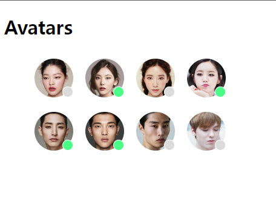

# <span style="color:orange"> Avatars </span>

## Intro

멋쟁이 사자처럼 프론트엔드 스쿨 12기 **공세현**입니다.

2주차 과제 Avatars 화면 구성 코드 설명을 시작하겠습니다.

## avatars.html

```
<!DOCTYPE html>
<html lang="ko-KR">
  <head>
    <meta charset="UTF-8" />
    <meta name="viewport" content="width=device-width, initial-scale=1.0" />
    <title>Avatars 과제</title>
    <link rel="preload" href="./../assets/avatars/face1.jpg" as="image" />
    <link rel="preload" href="./../assets/avatars/face2.jpg" as="image" />
    <link rel="preload" href="./../assets/avatars/face3.jpg" as="image" />
    <link rel="preload" href="./../assets/avatars/face4.jpg" as="image" />
    <link rel="preload" href="./../assets/avatars/face5.jpg" as="image" />
    <link rel="preload" href="./../assets/avatars/face6.jpg" as="image" />
    <link rel="preload" href="./../assets/avatars/face7.jpg" as="image" />
    <link rel="preload" href="./../assets/avatars/face8.jpg" as="image" />

    <link rel="stylesheet" href="./styles/avatars.css" />
  </head>
```

<br>

먼저 헤드부분입니다.

이미지를 불러올 때 preload 속성을 이용해 이미지 로딩 속도를 최적화 시키려고 하였습니다.

만일 이미지 파일 변환이 가능하다면 .webp 확장자를 사용하면 로딩 속도에 이점이 있을 것으로 생각됩니다.

<br>

```
  <body>
    <h1>Avatars</h1>

    <div>
      <ul>
        <li>
          
          <div class="indicator"></div>
        </li>
        <li>
          
          <div class="indicator online"></div>
        </li>
        <li>
          
          <div class="indicator"></div>
        </li>
        <li>
          
          <div class="indicator online"></div>
        </li>
        <li>
          
          <div class="indicator online"></div>
        </li>
        <li>
          
          <div class="indicator online"></div>
        </li>
        <li>
          
          <div class="indicator"></div>
        </li>
        <li>
          
          <div class="indicator"></div>
        </li>
      </ul>
    </div>
  </body>
</html>
```

<br>

바디 부분입니다.

ul 리스트 내부의 li 마다 사진을 불러오기 위한 img와 상태를 표시해주는 원을 그리기 위해 div에 class=indicator 또는 class=indicator online을 사용했습니다.

<br>

## avatars.css

<br>

```
ul {
width: 396px;
height: 195px;
}
```

<br>

ul에 width 값과 height값을 고정해 화면 조절을 해도 레이아웃이 유지되도록 하였습니다.

<br>

```
li {
position: relative;
list-style: none;
float: left;
}
```

<br>

이미지에 원을 붙이려면 기준점을 리스트 요소로 해야하기 때문에 position에 relative 선언을 하였습니다.

화면 상 리스트 요소마다 생기는 점 표시를 없애기 위해 list-style을 none으로 하였습니다.

float에는 left 값을 사용하여 리스트 요소들을 배치하였습니다.

<br>

```
img {
width: 64px;
height: 64px;
border-radius: 50%;
margin: 10px;
}
```

<br>

width 값과 height 값에 모두 정해진 64px씩 주었습니다.

원형으로 사진을 꾸미기 위해 border-radius를 50%로 주었습니다.

아바타 이미지끼리 간격을 20px로 맞추기 위해 margin을 10px씩 주었습니다.

<br>

```
.indicator {
position: absolute;
left: 56.22px;
top: 56.22px;
width: 17.78px;
height: 17.78px;
background-color: #dbdbdb;
border: 1px solid white;
border-radius: 50%;
box-sizing: border-box;
}

.indicator.online {
background-color: #4cfe88;
}
```

<br>

원을 img위에 올리기 위해 position을 absolute로 주었습니다.

원의 위치와 크기는 figma를 참고하여 설정하였고 원의 색상 또한 주어진 그대로 사용했습니다.

원의 테두리가 흰색으로 보여 border에 1px씩 흰색으로 나타나도록 하였습니다.

또 초록 원과 회색 원을 따로 쓰려면 배운 것으로는 코드 길이가 불필요하게 길어질 것 같아 검색을 통해 HTML에는 div에 class="indicator online"으로 선언을 하고 CSS에서는 .indicator.online를 사용하면 이를 방지할 수 있다는 사실을 배웠고 이를 적용하였습니다.

<br>

## 마무리 및 완료된 화면 구성



<br>

이렇게 화면 구성을 주어진 과제의 내용과 동일하게 구현해 보았습니다.

**_읽어주셔서 감사합니다._**
