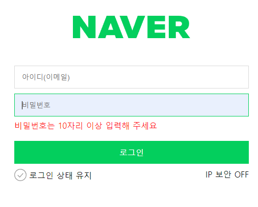

# <span style="color:orange"> Login </span>

## Intro

과제 링크 :

멋쟁이 사자처럼 프론트엔드 스쿨 12기 **공세현**입니다.

3주차 과제 Login 화면 구성 코드 설명을 시작하겠습니다.

과제 조건 위주로 따라가면서 전체 코드에서 조금씩 설명 드리겠습니다.

## login.html

```
  <head>
    ...
    <link rel="preload" href="./../assets/login/checked.svg" as="image" />
    <link rel="preload" href="./../assets/login/unchecked.svg" as="image" />

    <link rel="stylesheet" href="./styles/login.css" />
  </head>
```

먼저 `<head>` 부분입니다. 체크박스 이미지의 빠른 렌더링을 위해 미리 불러 들였습니다.

```
<body>
  <div class="login-box">
    <header>
      <h1 class="logo-naver">
        <svg role="image" width="230" height="44" viewBox="0 0 230 44" fill="none" xmlns="http://www.w3.org/2000/svg">
          <title>네이버 로고</title>
          .................................. (svg 내용)
        </svg>
      </h1>
    </header>
```

바디 부분입니다.

`login-box`라는 큰 `div`로 전체를 묶었습니다.

`svg` 요소를 `html` 파일에 직접 가져와 마크업 하였습니다.

또 웹 접근성을 고려하여 HTML 네이티브 방식으로 `<title>` 태그를 활용하였습니다.

```
      <main class="login-main">
        <form action="#" class="login-form">...
        </form>

        <div class="switch-ui">...
        </div>
      </main>

    </div>
  </body>
</html>
```

`<header>` 태그 이후 `<main>` 태그로 폼 및 스위치 ui 컴포넌트를 묶었습니다.

```
<form action="#" class="login-form">
          <div class="login-id">
            <label for="login-id" class="login-id__label sr-only">아이디</label>
            <input type="email" class="login-input" placeholder="아이디(이메일)" required name="login-id" id="login-id" />
            <p class="login-error-message">아이디는 이메일 형식으로 입력해 주세요</p>
          </div>
          <div class="login-pwd">
            <label for="login-pwd__input" class="login-pwd__label sr-only">비밀번호</label>
            <input type="password" class="login-input" placeholder="비밀번호" required name="login-pwd" id="login-pwd" minlength="10" />
            <p class="login-error-message">비밀번호는 10자리 이상 입력해 주세요</p>
          </div>

          <button type="submit" class="login-button">로그인</button>
        </form>
```

폼 입니다.

각각 `sr-only`를 이용해 아이디, 비밀번호 라벨을 안 보이게 달았습니다.

`<input>`에는 `required` 속성을 달아 필수라는 의미를 담았고 각각 아이디는 `type="email"`, 비밀번호는 10자 이상을 지키기 위해 조건으로 `minlength="10"`을 달아주었습니다.

```
        <div class="switch-ui">
          <div class="login-state">
            <input type="checkbox" class="login-state__checkbox" name="login-state" id="login-state" />
            <label for="login-state" class="login-state__label">
              <span class="login-state__icon" tabindex="0"></span>
              로그인 상태 유지
            </label>
          </div>

          <div class="ip-secure">
            <a href="./pages/ip_security.html" target="_blank" class="ip-secure__link">IP 보안 OFF</a>
          </div>
        </div>
      </main>
    </div>

  </body>
</html>
```

컴포넌트가 체크박스의 의미를 가지고 있으니 `checkbox`를 사용했습니다.

배경 이미지에 키보드 포커스를 위해 `<label>` 태그 안의 `<span>` 요소에 `tabindex="0"`을 주었습니다.

그 아래엔 ip 보안 컴포넌트에는 `<a>` 태그를 사용했습니다.

<br>

## login.css

```
@import "./../../assets/login/mini-reset.css";
@import "./../../assets/login/a11y.css";
```

`mini-reset.css`파일과 `sr-only`를 위한 `a11y.css` 파일을 가져왔습니다.

```
:root {
  --black: #121212;
  --green: #03cf5d;

  --text-base: 1rem;
}

body {
  font-size: var(--text-base);
  color: var(--black);
}
```

`Custom Properties` 기능을 활용해 기본 폰트 크기와 글자 색상을 지정했습니다.

```
*:focus {
  outline: 1px solid #24388d;
  border: none;
}
```

모든 포커스 스타일을 주어진 커스텀 색상으로 변경하였습니다.

```
.login-box {
  display: flex;
  flex-flow: column nowrap;
  align-items: center;

  header {
    display: flex;
    justify-content: center;

    .logo-naver {
      margin-top: 4.375rem;
      margin-block-start: 4.375rem;

      @media (min-width: 769px) {
        margin-top: 6.25rem;
        margin-block-start: 6.25rem;
      }
    }
  }
  ...
```

전체 요소들과 로고 부분에 `flex`를 활용해 가운데 정렬을 하였고

모바일/데스크탑 별로 로고 기준 위쪽 방향에 `margin`을 주었습니다.

```
  .login-main {
    width: 100%;
    inline-size: 100%;
    box-sizing: border-box;

    display: flex;
    flex-flow: column nowrap;
    align-items: center;

    padding-left: 1.25rem;
    padding-right: 1.25rem;
    padding-inline: 1.25rem;

    margin-top: 2.1875rem;
    margin-block-start: 2.1875rem;

    @media (min-width: 769px) {
      width: 500px;
      inline-size: 500px;

      margin-top: 2.5rem;
      margin-block-start: 2.5rem;
    }
```

폼과 `switch-ui`를 `flex`를 이용해 가운데 정렬을 하였습니다.

또 로고를 제외한 메인 컨텐츠에 `padding`, `margin` 값을 방향에 맞게 주었고

마찬가지로 모바일/데스크탑 환경에 따라 가로 길이와 `margin` 값을 따로 주었습니다.

```
    .login-form {
      width: 100%;
      inline-size: 100%;

      .login-input {
        width: 100%;
        inline-size: 100%;
        box-sizing: border-box;

        font-size: 0.875rem;
        height: 2.8125rem;
        block-size: 2.8125rem;

        padding: 0.875rem;

        margin-top: 0.625rem;
        margin-block-start: 0.625rem;

        border: 0.0625rem solid #dadada;
        background-color: #fff;

        &:focus {
          outline: none;
          border: 0.0625rem solid var(--green);
          background-color: #e9f0fd;
        }
      }
```

반응형 배치를 위해 `login-form`, `login-input` 모두에 `inlinl-size`를 `100%`로 주었습니다.

`rem` 단위로 폰트 크기와 높이, `padding`, `margin` 값을 주었습니다.

테두리 디자인, 포커스 상태의 디자인 또한 주어진 대로 맞춰 디자인 하였습니다.

```
      .login-button {
        width: 100%;
        inline-size: 100%;

        font-size: 1rem;
        height: 2.8125rem;
        block-size: 2.8125rem;

        margin-top: 1.25rem;
        margin-block-start: 1.25rem;

        color: #fff;
        background-color: var(--green);

        border: none;
      }
```

버튼 디자인도 지정해 주신 대로 작성하였고 반응형 디자인을 위해 `inline-size`를 100%로 하였습니다.

```
      .login-error-message {
        display: none;
        margin-top: 0.4375rem;
        color: #ff1414;
      }

      .login-id:focus-within .login-error-message,
      .login-pwd:focus-within .login-error-message {
        display: block;
      }
    }
```

로그인 할 때 에러 메시지 입니다.

`JS`를 사용하지 않는 방법을 찾아내지 못해 대안으로 `CSS` 만으로 아이디, 패스워드 칸에 포커스 했을 때(`:focus-within`) 각각 에러 메시지가 나오도록 해 사용자가 에러 메시지를 인지하도록 하였습니다.



해당 이미지입니다.

```
    .switch-ui {
      width: 100%;
      inline-size: 100%;

      margin-top: 0.625rem;
      margin-block-start: 0.625rem;
      display: flex;
      flex-flow: row nowrap;
      justify-content: flex-end;

      @media (min-width: 769px) {
        justify-content: space-between;
      }
```

`스위치 UI` 컴포넌트도 `미디어 쿼리`를 이용해 모바일에서는 오른쪽 끝 `flex-end` 에, 데스크탑에서는 양 끝 `space-between` 에 배치되도록 하였습니다.

```
      .login-state {
        .login-state__checkbox {
          display: none;
        }
```

로그인 상태 아이콘을 구현하기 위해 기본 체크박스는 `none`으로 없앴습니다.

```
        .login-state__label {
          display: inline-flex;
          align-items: center;
          position: relative;
```

배치를 가로로 되도록 맞춰주었고

```
          .login-state__icon {
            display: block;
            height: 24px;
            block-size: 24px;
            width: 24px;
            inline-size: 24px;
            margin-right: 0.3125rem;
            margin-inline-end: 0.3125rem;

            background-image: url("./../../assets/login/unchecked.svg");
            background-size: contain;
            background-repeat: no-repeat;
          }
```

아이콘 크기, 오른쪽 여백도 맞춰 주고 배경 이미지로 불러들였습니다.

```
          .login-state__checkbox:checked + & .login-state__icon {
            background-image: url("./../../assets/login/checked.svg");
          }
        }
      }
```

또 체크박스가 체크되었을 때 이미지가 바뀌도록 `:checked`를 사용했습니다.

```
      .ip-secure {
        font-size: 1rem;
        color: var(--black);

        display: none;
```

IP 보안도 모바일에서는 안보이도록 하였고

```
        @media (min-width: 769px) {
          display: block;

          .ip-secure__link {
            text-decoration: none;
            color: inherit;
          }
        }
      }
    }
  }
}
```

데스크탑 환경에서 보이도록 하였습니다.

## 마무리

과제를 늦게 시작을 했는데, 생각보다 고려해야 할 것이 많았던 터라 시간에 쫓겨 가면서 했습니다.

최대한 맞춰보려고 노력했지만 탭으로 체크박스가 접근은 되지만 엔터키로 상호작용이 안되는 점, 에러 메시지, IP 보안 ON/OFF 텍스트 수정, 마크다운 문서 퀄리티 등 하지 못한 것이 많고 많이 부족했다고 생각합니다.

이번 과제를 통해 한 주를 다시 돌아보는 기분이었고 내용을 정리하는 시간이 필요하다는 생각이 들었습니다.
또 검색을 하다보니 JS가 있으면 좋은 부분들이 있음을 많이 느꼈고 배워보고 싶다는 생각이 들었습니다.

**_읽어주셔서 감사합니다._**
